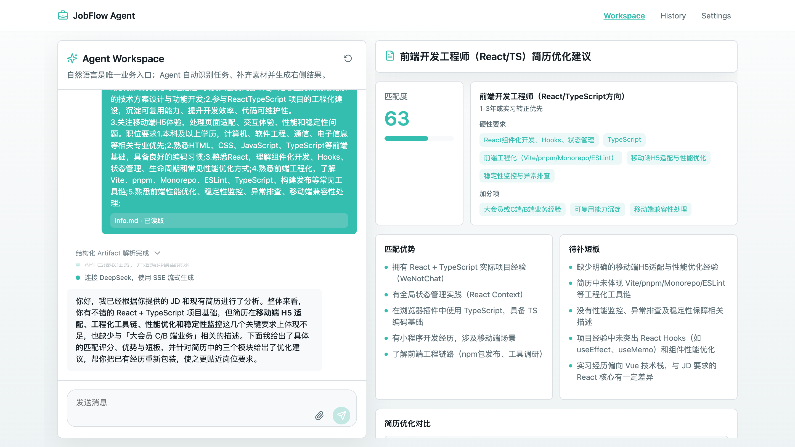
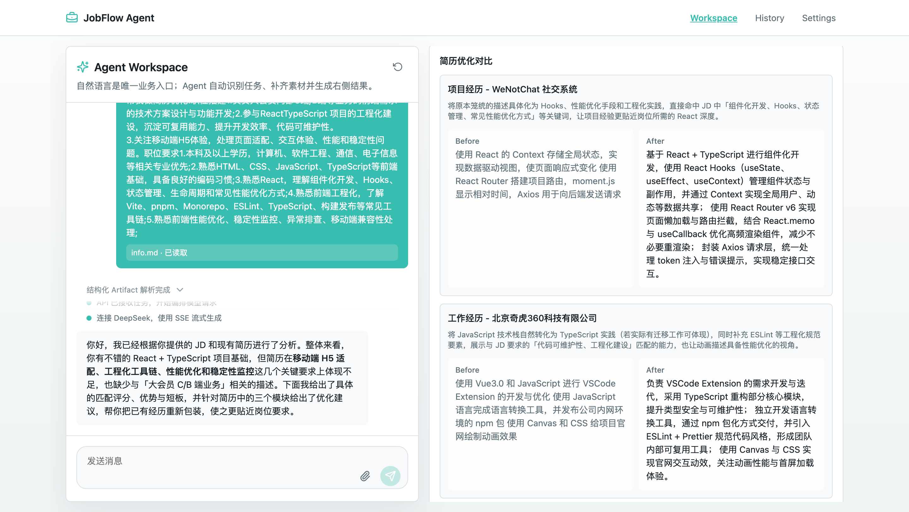
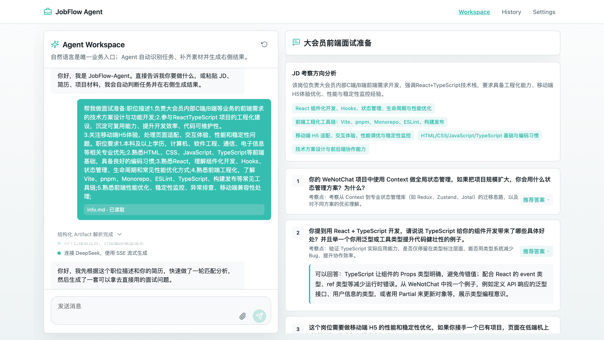
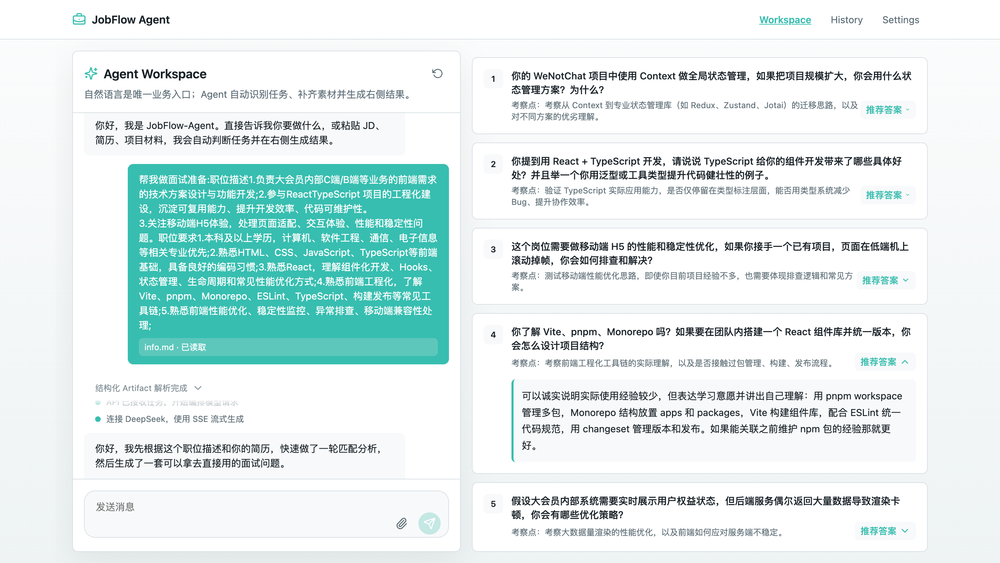
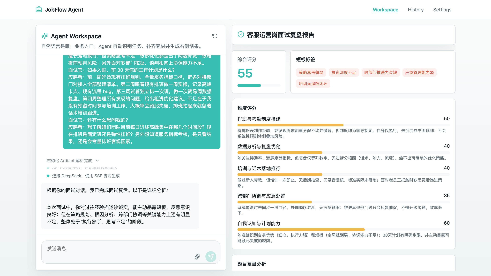
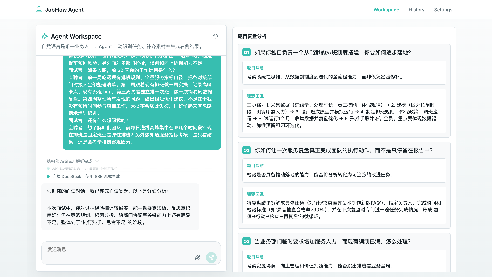
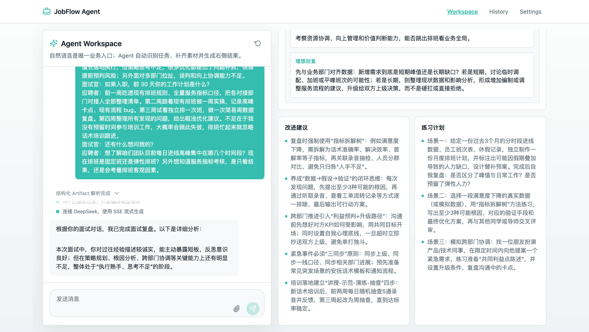
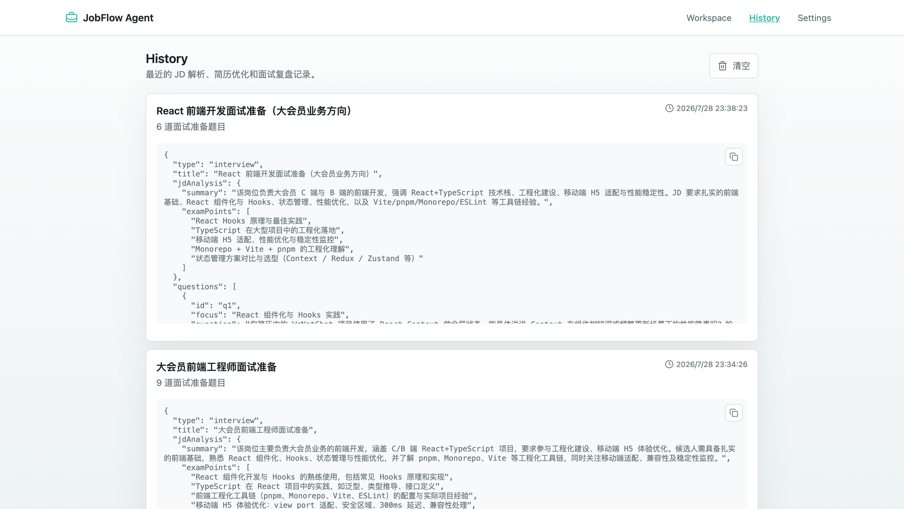
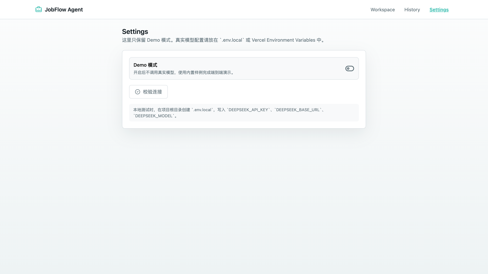

# JobFlow-Agent

单入口 Agent 求职工作台 MVP。用户只通过聊天输入需求，系统自动识别任务、校验素材、调用工作流，并在右侧动态渲染结构化 Artifact。

## Features

- JD 结构化解析 + 简历匹配优化
  <p align="center">
    
    
  </p>
- AI 面试准备 + 提供面试时需要注意的知识点&题目
  <p align="center">
    
    
  </p>
- 面试复盘 + 短板维度分析
  <p align="center">
    
    
    
  </p>
- DeepSeek SSE 服务端代理
- Demo 模式，无 API Key 也可演示完整流程
- 本地 History，只读查看历史结果
  <p align="center">
    
  </p>
- Settings 仅保留 Demo 模式和连接状态提示
  <p align="center">
    
  </p>

## Tech Stack

- Next.js App Router
- TypeScript
- CSS Module
- lucide-react
- DeepSeek OpenAI-compatible API
- localStorage 本地持久化

## Getting Started

```bash
npm install
npm run dev
```

打开 `http://localhost:3000`。

## Demo Flow

默认开启 Demo 模式，可直接在 Workspace 输入：

```text
帮我针对这个前端 JD 优化简历
```

如果缺少 JD 或简历，Agent 会主动追问。也可以上传 `.txt`、`.md`、`.pdf`、`.docx` 文件作为素材。

## Notes

- MVP 不包含登录系统，历史记录仅保存在当前浏览器。
- 文件上传只是素材输入入口，业务任务仍由聊天自然语言触发。
- 真实模型模式通过 `/api/chat` 转发 DeepSeek SSE，避免把 API Key 写入仓库。
- `.pdf` 和 `.docx` 在客户端解析为文本后进入 Agent 上下文。
- 本地开发请使用 `.env.local`，不要把真实密钥提交到仓库。
